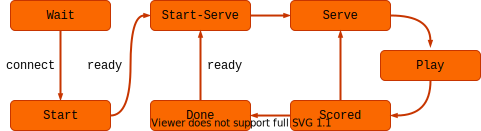

Pong 🏓
===

Pong is a classic video game created in the 70s by [Atari](https://en.wikipedia.org/wiki/Pong). I recreated this game as
the final project for the CS50 computer science course that I did in 2020.

The goal of this project is to create an online multiplayer version of the original Pong game.

Development
---
To help with the development of the game I used a number of freely available resources:
- JavaScript game library [Phaser3](https://phaser.io/) 🦄
- Another beek beep beer please music by [Rolemusic](https://freemusicarchive.org/music/Rolemusic/) 🤘
- Sounds created with [Bfxr](https://www.bfxr.net/) 🏆
- Sounds converted to MP3 with [Convertio](https://convertio.co/)
- Press Start 2P font by [Codeman38](https://www.fontspace.com/codeman38)
- Dead Space font by [DC-designs](https://www.dafont.com/devin-chandra.d8755) 🤩
- Lava texture by [Outworldz](https://www.outworldz.com/cgi/free-seamless-textures.plx)
- Server software [NodeJS](https://nodejs.org/)
- JavaScript 3rd party libraries as descripted in [package.json](package.json).
- I might have used [Stack Overflow](https://stackoverflow.com/questions?tab=Frequent) once or twice 🤣

All this software is free to use and is created by many unsung heroes of the internet 🦸‍♀️ 

Local installation
---
First install [NodeJS](https://nodejs.org/) version 13.2.0 or newer, if you haven't already.

Run `node install` inside the project folder. This will install the app and its dependencies.

Run `node src/main.js` to start the game server. It will be listening on port 3000 by default.

Then go to http://localhost:3000 in a web browser.

If you want to play a game against the computer, open the same url in a second browser window. 
Put them side by and have some fun! 🤖

Server installation
---
If you want to play online against a friend, you need to install the software on a public server that can accept incoming connnections.

You probably want to disable the robot and perhaps also the performance logging. Both are configured in [src/public/config.js](src/public/config.js).

Then start the server using `nohup node src/main.js &`. After that, if you leave the shell the program will keep running.

Send the url of the server to your friend and have some fun! 🏓

Game States
---

License
---
This project's is made public under the GNU GENERAL PUBLIC LICENSE. For more information see the project [LICENSE](LICENSE) file or visit [GNU.org](https://www.gnu.org/licenses/quick-guide-gplv3).

